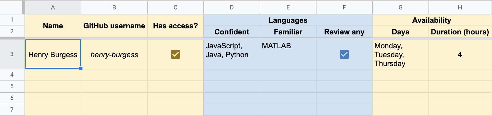
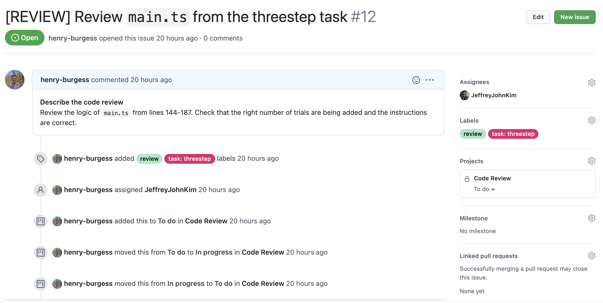
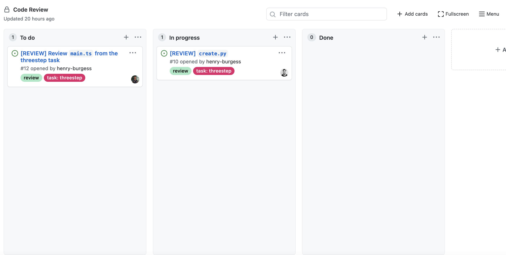
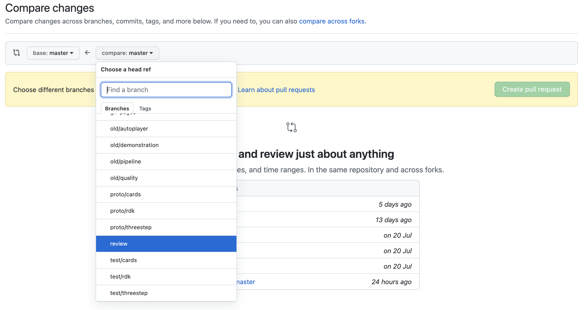
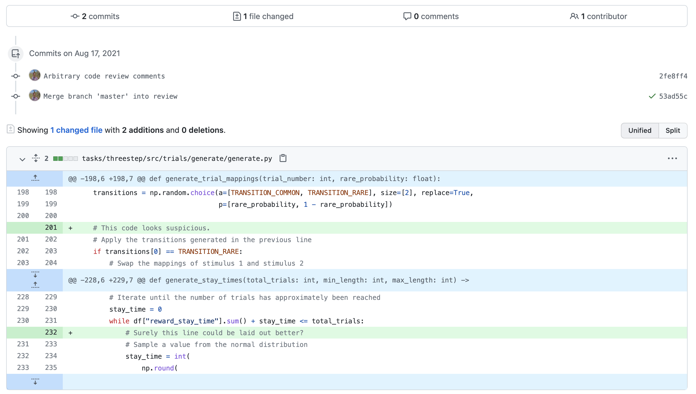
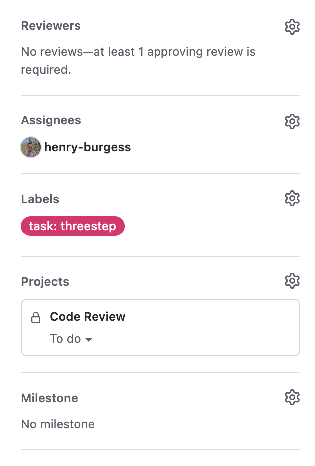

# Code Review

_Document Status:_ DRAFT v1.0 (31 August 2021)

## Document Objectives

This document aims to establish some guidelines for conducting code reviews of repositories in the Brain Development and Disorders Lab GitHub Organisation. The review process proposed will be a lightweight process rather than a heavy formal process. A general workflow can be found under the [Code Review Workflow](#code-review-workflow) section.

## Table of Contents

* [Processes](#processes)

  * [Allocations](#allocations)

  * [Preparing Code for Review](#preparing-code-for-review)

  * [Submitting Code for Review](#submitting-code-for-review)

  * [Documentation of Feedback](#documentation-of-feedback)

  * [Responding to Reviews](#responding-to-reviews)

* [Code Review Workflow](#code-review-workflow)

* [Best Practice](#best-practice)

* [Useful Articles and Resources](#useful-articles-and-resources)

## Processes

The following sections describe processes for requesting and conducting a code review.

### Preparing Code for Review

The code author should ensure that code proposed for review is well-annotated, making the intentions of the author clear to the prospective reviewer. Annotations should guide the reviewer through the code and include any justifications that would be appropriate to make. Authors should make use of inline commenting and multiline commenting (if the language supports it). Functions and methods should have existing documentation.

#### Dependencies

Codebases often have additional dependencies or configuration steps that are required prior to developing or running the project. The author should prepare the code review assuming that the reviewer will be reviewing the code on a 'fresh' system, with no dependencies or libraries installed or configured.

Most languages have dependency management tools that are used to manage dependencies in projects that utilise the language. For example, the Node Package Manager (`npm`) is an example of a dependency management tool that manages dependencies in projects that utilise Node.js and JavaScript. Python has `pipenv` (read more about `pipenv` [here](https://packaging.python.org/tutorials/managing-dependencies/)) and Ruby has `bundler` (read more about `bundler` [here](https://bundler.io/)).

Code authors should incorporate these tools into their projects where at all possible. These tools automatically generate files that track dependencies. If it is not possible or feasible to incorporate a dependency management tool, the author should create documentation outlining each of the dependencies of the project and steps to configure a 'fresh' machine for running or testing the project.

### Submitting Code for Review

The preferred method for submitting code for review is via a new issue. Templates can be provided to aid the prospective reviewer and ensure sufficient information is provided.

Details relating to the issue template can be found in the [Issues and Tickets SOP](Issues-and-Tickets-SOP.md).

### Allocations

A list should be maintained of collaborators who are willing to perform a Code Review. Collaborators should record their availability, as well as code expertise. Code expertise could be generalised into two factors: the languages the collaborator is familiar with, and their willingness to review the logic of code that they are probably unfamiliar with.

The existing Google Sheet with this information can be found [here](https://docs.google.com/spreadsheets/d/1O3GAD79pq-I06b6gHKzCHcsteQVK-xemPamVTtht40Q/edit?usp=sharing).



Allocations are as simple as assigning a collaborator to the existing Code Review issue. When creating a new Code Review issue, click the **Assignee** heading in the right column and select the collaborator from the drop-down menu. The default option is to assign yourself (the issue creator) to the Code Review issue.



Once a new Code Review issue has been created and allocated, the card representing the issue should be added to the _Code Review_ Project board. This board tool allows reviewers to mark their progress publicly and provide a global view of all code review progress. The Project board can be found under the _Projects_ tab of the GitHub repository if it has been enabled.



### Documentation of Feedback

All code reviews should use a separate _review_ branch. The _review_ branch should be up-to-date with the _main_ branch prior to starting the code review. It is the responsibility of the reviewer to make sure this is done. Using a separate branch allows us to take advantage of _pull requests_ in the code review process.

The primary method of leaving feedback inside of code is to use inline comments. Most languages also allow multiline comments using specialised syntax. It is advisable to prepend the reviewer name to each comment, this makes it easier to distinguish additions to the code.

**Example 1 - Single line comment (JavaScript):**

```javascript
function add(a, b) {
    // (Henry) Brief comment. Usually one sentence placed above the line of interest.
    return a + b;
}
```

**Example 2 - Multi-line comment (Python):**

```python
def add(a: int, b: int) -> int:
    sum = 0
    for i in range(a):
      sum += 1
    for j in range(b):
      sum += 1
    """
    (Henry) While this strategy works for adding two
    numbers, it is quite verbose.
    Consider simply returning the sum of a and b 
    using the '+' operand like so:
        return a + b
    """
    return sum
```

An alternate method of leaving feedback is to list comments in a separate document, noting the lines of interest. A recommended method of using a feedback document is given below:

**Example 3 - Feedback Document (Markdown):**

```markdown
# Code Review Feedback (30 August 2021)
## Review Details:
**Reviewer:** Henry
**File:** main.js

## Comments:
**(Line 235)** This line is possibly unnecessary. Line 234 already shuffles the array as part of the operation.
**(Line 257)** The variable name 'x' does not describe the use of the variable. Consider renaming it to 'trialCount'.
...
```

If a bug or unexpected behaviour is found, an issue should also be created, as discussed in the [Issues and Tickets SOP](Issues-and-Tickets-SOP.md).

#### Good Feedback

Feedback should be _specific_, _objective_, _actionable_, and _concise_.

* **Specific**: Each comment or piece of feedback should point directly to a line or block of code. The feedback should be placed as close as reasonably possible to the line it is related to.

* **Objective**: Devoid of any personal criticism. The review should be a critique of the code rather than the author.

* **Actionable**: The feedback should be clear in what can be done to resolve the issue. An alternate strategy or suggestion would be ideal, otherwise a question for follow-up is also suitable.

* **Concise**: Concise feedback reduces the time required to understand the feedback, ultimately taking less of the reviewer's and author's time.

#### Finalising Feedback (Inline Comments)

Firstly, ensure that all feedback and comments have been pushed to the `review` branch of the repository. Once the changes have been pushed to the remote repository, a 'pull request' can be created to notify the author that you have finished reviewing the code and are looking to finalise feedback.

To create a pull request, select the _Pull requests_ tab located to the right of the _Issues_ tab. Then, click the green _New pull request_ button to the right of the screen. This will present a screen where two branches can be selected. The branch in the left drop-down is by default the _master_ (or _main_) branch that contains the most stable version of the code. The branch in the right drop-down is the branch to be merged into the branch in the left drop-down. In this context, the _review_ branch should be selected from the right drop-down.



After creating the pull request, a comparison of the changed files and commit history can be seen.



Click the green _View pull request_ button in the top right. In the sidebar on the right, set the _Reviewer_ to the author of the code which was reviewed. This will notify the author that you have completed the review.



#### Finalising Feedback (Separate Document)

If a separate document was used, simply return the document to the author via email.

### Responding to Reviews

To query any of the feedback offered by reviewers, normal communication methods can be used such as email, comments on pull request, etc. It is advisable that for any significant feedback that reviewers and authors try and meet F2F (where safe and appropriate) or via Zoom.

#### Pull Requests

A code review pull request does not need to be merged. Authors and reviewers can use the comment functionality of the pull request to reply to feedback and to make suggestions. When the authors and reviewers have come to a consensus regarding the code review feedback, the pull request should be closed and the feedback actioned accordingly.

---

## Code Review Workflow

Below is a list of steps recommended for undertaking a code review. A link to the relevant section of the SOP is prepended to each step.

### For Authors

1. ([Preparing Code for Review](#preparing-code-for-review)) Finalise a section of code to be reviewed. Ensure it is functional and achieves any objectives.

2. ([Preparing Code for Review](#preparing-code-for-review)) Document the section of code extensively, being sure to justify any design decisions.

3. ([Preparing Code for Review](#preparing-code-for-review)) Review any related literature to ensure the code is aligned with any prior documentation.

4. ([Preparing Code for Review](#preparing-code-for-review)) Identify the exact section of code to be reviewed, noting the filename, line numbers, and branch (if relevant).

5. ([Dependencies](#dependencies)) Document any dependencies and assemble a guide for running or testing the code if required.

6. ([Allocations](#allocations)) Review the spreadsheet of potential reviewers and organise a reviewer for the section of code.

7. ([Submitting Code for Review](#submitting-code-for-review)) Create a new Code Review issue and assign the reviewer to the issue.

8. ([Submitting Code for Review](#submitting-code-for-review)) Place the issue on the Code Review project board.

9. ([Responding to Reviews](#responding-to-reviews)) Once the code review has been completed, respond to the feedback as required.

### For Reviewers

1. Become familiar with the region of code to be reviewed. Skim the code to try and understand the fundamental purpose of the code.

2. Review the author's notes regarding the code, taking note of any dependencies or requirements to review the code.

3. Configure and test any setup or dependencies required for the review, noting any issues encountered.

4. Negotiate with the author whether a pull request or separate document will be used to document feedback.

5. ([Documentation of Feedback](#documentation-of-feedback)) Locate and commence review of the region of code.

6. ([Documentation of Feedback](#documentation-of-feedback)) Record and backup all feedback on the region of code.

7. ([Documentation of Feedback](#documentation-of-feedback)) Finalise and return feedback to the author, and respond to any queries and clarifications from the author.

---

## Best Practice

* It is best to keep the volume of code to review within 400 lines. This ensures that a quality code review can be completed in reasonable time.

* Be specific and precise with the regions of code to be reviewed. Provide exact line numbers and ensure code is annotated extensively. This ensures that none of the reviewers time is wasted.

## Useful Articles and Resources

* [Google Eng-Practices - How to do a code review](https://google.github.io/eng-practices/review/reviewer/)

* [Git cheat sheet by GitHub](https://education.github.com/git-cheat-sheet-education.pdf)

* [Best Practices for Code Review](https://smartbear.com/learn/code-review/best-practices-for-peer-code-review/)

---

## References

* [Google Eng-Practices - How to do a code review](https://google.github.io/eng-practices/review/reviewer/)

* [Best Practices for Code Review](https://smartbear.com/learn/code-review/best-practices-for-peer-code-review/)
