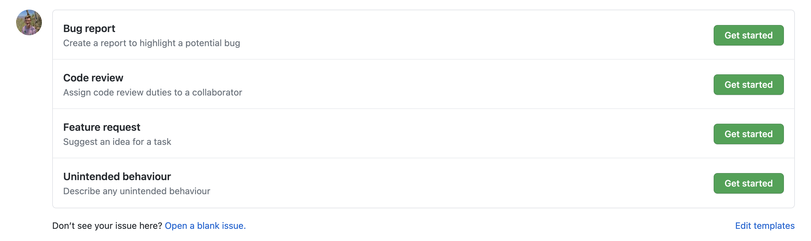
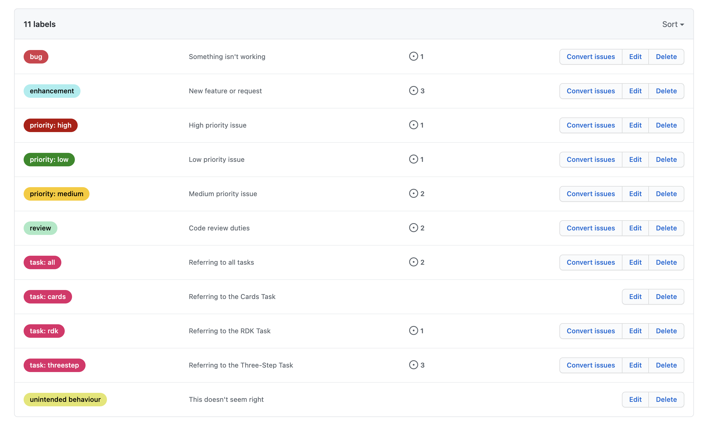

# Issues and Tickets

_Document Status:_ v1.0 (16 August 2021)

The purpose of this page is to document the standard operating procedure (SOP) relating to issues and tickets within the Brain Development and Disorders Lab GitHub Organisation.

## Table of Contents

* [Issue and Ticket Templates](#issue-and-ticket-templates)

  * [Bug report](#bug-report)

  * [Code review](#code-review)

  * [Feature request](#feature-request)

  * [Unintended behaviour](#unintended-behaviour)

* [Issue Labels](#issue-labels)

  * [Issue Type Labels](#issue-type-labels)

  * [Prioritisation Labels](#prioritisation-labels)

  * [Task Labels](#task-labels)

## Issue and Ticket Templates

This section will describe each of the templates available when creating a new issue or ticket.

### Bug report

Bug report issues describe any behaviour that is not only unexpected, but possibly detrimental to reaching the research objectives. A bug may impact data collection or participant experience.

A bug report issue should contain a description of the bug, instructions to reproduce the bug, and as much information as possible relating to the platform or browser the bug occurred in. Expected behaviour should also be described.

Bug report issues are automatically given the _bug_ label and assigned to the repository owner. Task labels should be applied to ensure bugs can be filtered by task. A prioritisation label should also be applied if multiple bugs have been identified.

### Code review

Code review issues are used to assign code review responsibilities. They can be assigned to any member of the repository.

A code review issue should contain a brief description of the code to be reviewed. The description should be supplemented with any screenshots or references to literature that help explain the code to be reviewed.

Code review issues are automatically given the _review_ label. Code review issues should be assigned to the individual responsible for reviewing the code. Task labels should be applied to ensure code review issues can be filtered by task. A prioritisation label should also be applied if a region of code is to be prioritised over another.

### Feature request

Feature request issues are good way to discuss any additional features or behaviours that could be incorporated into the task. These are features that are not necessarily discussed directly in literature.

A feature request issue should discuss the specific challenge that the task currently contains, and how a new feature may minimise or remove the challenge entirely. It should also discuss any alternative solutions considered alongside additional context if required.

Feature request issues are automatically given the _enhancement_ label and assigned to the repository owner. Task labels should be applied to ensure feature request issues can be filtered by task. A prioritisation label should also be applied if a feature is to be prioritised over another.

### Unintended behaviour

Unintended behaviour issues describe any behaviour identified in the task that is unintended or incongruent with what is described in literature. The behaviours would not typically be as noticeable as those described in a bug report, and they would likely not be identified by a participant.

An unintended behaviour issue should contain a brief description of the behaviour and how it manifests in the task. It should also include steps to reproduce the behaviour. Importantly, any literature or data explaining the correct intended behaviour should be discussed.

Unintended behaviour issues are automatically given the _unintended behaviour_ label and assigned to the repository owner. Task labels should be applied to ensure unintended behaviour issues can be filtered by task. A prioritisation label should also be applied as required.

## Issue Labels

This section will outline the specific label categories and intended usage.

### Issue Type Labels

* _bug_ - Bug report.
* _review_ - Code review.
* _enhancement_ - Feature request.
* _unintended behaviour_ - Unintended behaviour.

### Prioritisation Labels

* _priority: low_ - Low priority. Not urgent or a breaking bug.
* _priority: medium_ - Medium priority. Needs resolution in a timely manner.
* _priority: high_ - High priority. Critical issue. Usually a bug or unexpected behaviour noticed by a participant.

### Task Labels

* _task: all_ - Relates to all tasks.
* _task: cards_ - Relates to the Cards task.
* _task: rdk_ - Relates to the RDK task.
* _task: threestep_ - Relates to the Three-Step task.
